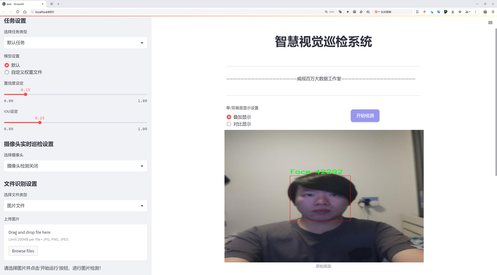
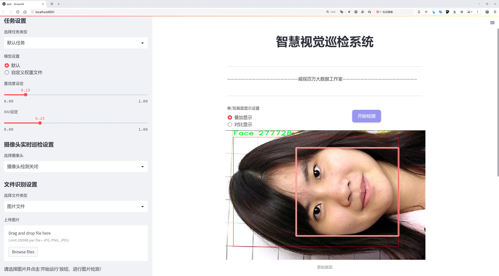
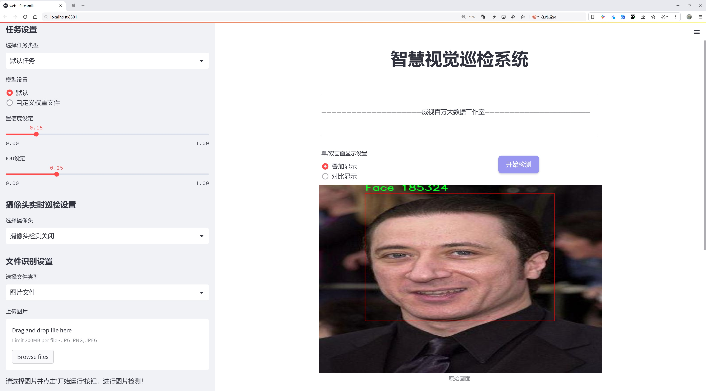
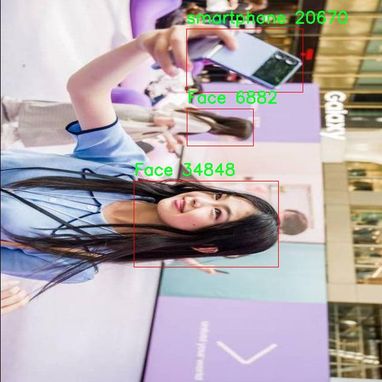
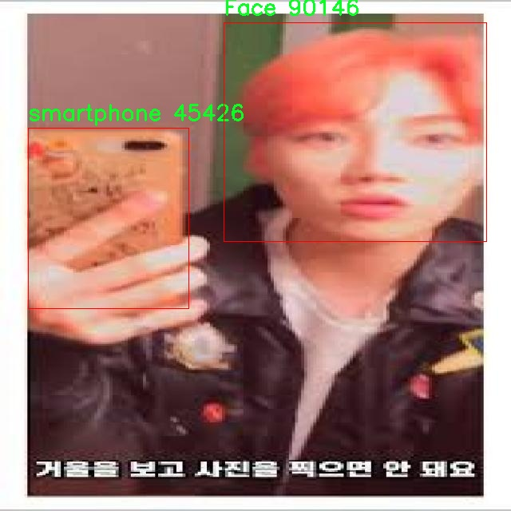
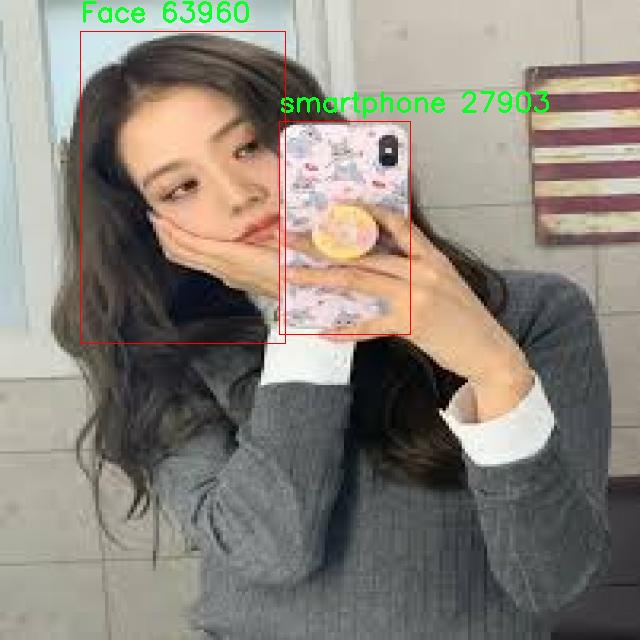

# 人脸活体检测检测系统源码分享
 # [一条龙教学YOLOV8标注好的数据集一键训练_70+全套改进创新点发刊_Web前端展示]

### 1.研究背景与意义

项目参考[AAAI Association for the Advancement of Artificial Intelligence](https://gitee.com/qunmasj/projects)

项目来源[AACV Association for the Advancement of Computer Vision](https://github.com/qunshansj/good)

研究背景与意义

随着人工智能技术的迅猛发展，尤其是在计算机视觉领域的突破，基于深度学习的人脸识别技术已广泛应用于安全监控、金融支付、智能家居等多个领域。然而，随着这些技术的普及，面临的安全隐患也日益突出，尤其是针对人脸识别系统的欺骗攻击，如照片、视频或面具等伪造手段的使用。这些攻击手段不仅影响了人脸识别的准确性，还可能导致严重的安全事故。因此，开发一种高效、准确的人脸活体检测系统显得尤为重要。

在这一背景下，YOLO（You Only Look Once）系列模型因其高效的实时检测能力而受到广泛关注。YOLOv8作为该系列的最新版本，结合了多种先进的深度学习技术，具有更高的检测精度和更快的处理速度。然而，传统的YOLOv8模型在处理人脸活体检测时，仍然存在一定的局限性，尤其是在复杂环境下的识别能力。因此，基于改进YOLOv8的人脸活体检测系统的研究具有重要的理论价值和实际意义。

本研究将采用Wahidun数据集，该数据集包含2966张图像，涵盖了6个类别，包括人脸、佩戴口罩的面孔、身份证照片、个人身份信息、普通照片以及智能手机等。这些类别的多样性为训练和测试人脸活体检测模型提供了丰富的样本，有助于提高模型的泛化能力和鲁棒性。通过对该数据集的深入分析和处理，可以有效提升YOLOv8在活体检测中的应用效果。

改进YOLOv8模型的关键在于优化其特征提取和分类算法，以增强其对活体特征的敏感性。具体而言，可以通过引入注意力机制、数据增强技术以及多尺度特征融合等方法，提升模型对真实人脸与伪造图像的区分能力。此外，结合深度学习与传统图像处理技术，探索多模态信息融合的可能性，将为人脸活体检测提供更为全面的解决方案。

本研究的意义不仅在于提升人脸活体检测的准确性和实时性，更在于为后续相关研究提供基础。通过对YOLOv8模型的改进与优化，能够为人脸识别技术的安全性提供有力保障，推动其在金融、安防等领域的应用。此外，研究成果还将为相关领域的学术研究提供新的思路和方法，促进人脸识别技术的健康发展。

综上所述，基于改进YOLOv8的人脸活体检测系统的研究，不仅具有重要的学术价值，更具备广泛的应用前景。通过深入探索和解决当前人脸活体检测面临的挑战，能够为构建更加安全、可靠的智能系统贡献力量。

### 2.图片演示







##### 注意：由于此博客编辑较早，上面“2.图片演示”和“3.视频演示”展示的系统图片或者视频可能为老版本，新版本在老版本的基础上升级如下：（实际效果以升级的新版本为准）

  （1）适配了YOLOV8的“目标检测”模型和“实例分割”模型，通过加载相应的权重（.pt）文件即可自适应加载模型。

  （2）支持“图片识别”、“视频识别”、“摄像头实时识别”三种识别模式。

  （3）支持“图片识别”、“视频识别”、“摄像头实时识别”三种识别结果保存导出，解决手动导出（容易卡顿出现爆内存）存在的问题，识别完自动保存结果并导出到tempDir中。

  （4）支持Web前端系统中的标题、背景图等自定义修改，后面提供修改教程。

  另外本项目提供训练的数据集和训练教程,暂不提供权重文件（best.pt）,需要您按照教程进行训练后实现图片演示和Web前端界面演示的效果。

### 3.视频演示

[3.1 视频演示](https://www.bilibili.com/video/BV17SHWeVEbh/?vd_source=ff015de2d29cbe2a9cdbfa7064407a08)

### 4.数据集信息展示

##### 4.1 本项目数据集详细数据（类别数＆类别名）

nc: 6
names: ['Face', 'face_mask', 'foto_ktp', 'identitas', 'photo', 'smartphone']


##### 4.2 本项目数据集信息介绍

数据集信息展示

在本研究中，我们使用了名为“Wahidun”的数据集，以支持对YOLOv8模型的改进，旨在提升人脸活体检测系统的性能。该数据集包含六个类别，具体为“Face”、“face_mask”、“foto_ktp”、“identitas”、“photo”和“smartphone”。这些类别的选择不仅反映了人脸识别技术在实际应用中的多样性，也为模型的训练提供了丰富的样本，确保其在不同场景下的鲁棒性和准确性。

首先，数据集中的“Face”类别是基础类别，包含了多种人脸图像。这些图像可能来自不同的角度、光照条件和表情变化，确保模型能够学习到人脸的多样性特征。这对于提高人脸活体检测的准确性至关重要，因为模型需要能够在各种环境下识别出真实的人脸。

其次，“face_mask”类别的引入则是为了应对当今社会中口罩佩戴的普遍现象。在疫情期间，许多人在公共场合佩戴口罩，这对传统的人脸识别系统构成了挑战。因此，数据集中包含了这一类别，旨在训练模型识别佩戴口罩的人脸，提升其在特殊情况下的识别能力。

“foto_ktp”和“identitas”这两个类别则主要涵盖了身份证件和其他身份识别材料的图像。这些图像不仅包括个人的面部特征，还可能包含一些额外的信息，如姓名、出生日期等。这些信息对于活体检测系统来说是重要的，因为在许多应用场景中，系统需要验证用户的身份，而不仅仅是识别面部特征。

“photo”类别则包含了各种形式的照片，这些照片可能是社交媒体上的个人照片、家庭照片等。这一类别的多样性使得模型能够接触到不同风格和背景的图像，从而增强其对真实世界场景的适应能力。

最后，“smartphone”类别的引入则反映了现代技术的普及，许多人通过智能手机拍摄和分享照片。该类别的样本可能包括手机拍摄的人脸图像，模型通过学习这些图像，可以更好地适应来自移动设备的图像输入，提升其在实际应用中的实用性。

综上所述，“Wahidun”数据集的多样性和丰富性为YOLOv8模型的训练提供了坚实的基础。通过涵盖多种人脸图像及其相关场景，该数据集不仅有助于提升模型在标准条件下的表现，也为其在复杂和多变的环境中提供了必要的训练支持。这种全面的训练数据将使得最终的人脸活体检测系统在实际应用中更具可靠性和有效性，为人脸识别技术的进一步发展奠定了坚实的基础。








### 5.全套项目环境部署视频教程（零基础手把手教学）

[5.1 环境部署教程链接（零基础手把手教学）](https://www.ixigua.com/7404473917358506534?logTag=c807d0cbc21c0ef59de5)


[5.2 安装Python虚拟环境创建和依赖库安装视频教程链接（零基础手把手教学）](https://www.ixigua.com/7404474678003106304?logTag=1f1041108cd1f708b01a)

### 6.手把手YOLOV8训练视频教程（零基础小白有手就能学会）

[6.1 环境部署教程链接（零基础手把手教学）](https://www.ixigua.com/7404477157818401292?logTag=d31a2dfd1983c9668658)

### 7.70+种全套YOLOV8创新点代码加载调参视频教程（一键加载写好的改进模型的配置文件）

[7.1 环境部署教程链接（零基础手把手教学）](https://www.ixigua.com/7404478314661806627?logTag=29066f8288e3f4eea3a4)

### 8.70+种全套YOLOV8创新点原理讲解（非科班也可以轻松写刊发刊，V10版本正在科研待更新）

由于篇幅限制，每个创新点的具体原理讲解就不一一展开，具体见下列网址中的创新点对应子项目的技术原理博客网址【Blog】：


[8.1 70+种全套YOLOV8创新点原理讲解链接](https://gitee.com/qunmasj/good)

### 9.系统功能展示（检测对象为举例，实际内容以本项目数据集为准）

图9.1.系统支持检测结果表格显示

  图9.2.系统支持置信度和IOU阈值手动调节

  图9.3.系统支持自定义加载权重文件best.pt(需要你通过步骤5中训练获得)

  图9.4.系统支持摄像头实时识别

  图9.5.系统支持图片识别

  图9.6.系统支持视频识别

  图9.7.系统支持识别结果文件自动保存

  图9.8.系统支持Excel导出检测结果数据


### 10.原始YOLOV8算法原理

原始YOLOv8算法原理

YOLOv8是YOLO系列目标检测算法中的最新版本，由Glenn-Jocher团队提出。作为YOLO系列的继承者，YOLOv8在多个方面进行了显著的改进，旨在提升目标检测的精度和速度，尤其是在复杂环境下的表现。与以往的YOLO版本相比，YOLOv8采用了anchor-free的方法，摒弃了传统的anchor-based检测策略。这一转变使得YOLOv8在处理多样化的目标和背景时，能够更好地适应不同的检测任务，尤其是在小目标检测方面表现出色。

YOLOv8的网络结构主要由四个模块组成：输入端、主干网络、Neck端和输出端。输入端负责对输入图像进行预处理，包括Mosaic数据增强、自适应图片缩放和灰度填充等，以提高模型的鲁棒性和泛化能力。主干网络则通过一系列卷积和池化操作提取图像特征，YOLOv8在这一部分引入了C2f模块，替代了YOLOv5中的C3模块。C2f模块的设计灵感来源于YOLOv7的ELAN结构，通过增加分支和shortcut连接，提升了特征的流动性和梯度的回传效率，从而增强了特征提取的能力。

在特征融合方面，YOLOv8依然采用了FPN（特征金字塔网络）和PAN（路径聚合网络）的结合结构，以实现多尺度特征的有效融合。该结构能够将不同层次的特征进行深度整合，使得模型在处理不同大小的目标时，能够更好地捕捉到关键信息。此外，YOLOv8在Neck端引入了新的特征融合策略，确保了高层语义信息与低层细节信息的有效结合，从而提高了检测的准确性。

YOLOv8的输出端采用了解耦头（Decoupled Head）结构，这一设计使得分类和回归任务可以独立进行，进而提升了模型的性能。解耦头的实现方式是通过两个并行的分支分别提取类别特征和位置特征，最后通过1×1卷积进行分类和定位。这种解耦设计不仅提高了检测的精度，还有效降低了计算复杂度，使得YOLOv8在实时检测任务中表现更加优异。

在标签分配策略上，YOLOv8采用了Task-Aligned Assigner方法，这一策略通过动态匹配正负样本，解决了传统静态匹配方法在样本不平衡情况下的不足。YOLOv8的损失函数设计也进行了优化，分类损失采用了Varifocal Loss，而回归损失则结合了CIoU和DFL（Distribution Focal Loss）。这种损失函数的组合使得模型在训练过程中能够更好地聚焦于高质量的样本，提高了整体的检测精度。

尽管YOLOv8在多个方面进行了优化，但在复杂水面环境下的检测任务中，仍然面临着一些挑战。小目标漂浮物的特征复杂且背景多样，导致YOLOv8在定位和目标感知能力上存在一定的不足。为了解决这些问题，研究者们提出了YOLOv8-WSSOD算法的改进方案，旨在进一步提升YOLOv8在复杂环境下的表现。

YOLOv8-WSSOD算法的改进主要体现在几个方面。首先，为了减轻主干网络下采样过程中的噪声影响，YOLOv8-WSSOD引入了捕获远程依赖的思想，采用了BiFormer双层路由注意力机制构建C2fBF模块。这一模块能够在特征提取过程中保留更细粒度的上下文信息，从而提升模型对小目标的感知能力。其次，针对小目标漏检的问题，YOLOv8-WSSOD添加了一个更小的检测头，以增强网络对小目标的检测能力。同时，在Neck端引入GSConv和Slim-neck技术，以保持精度并降低计算量。最后，YOLOv8-WSSOD使用MPDIoU损失函数替换了CIoU损失函数，进一步提高了模型的泛化能力和精准度。

总的来说，YOLOv8通过一系列创新性的设计和改进，提升了目标检测的性能，尤其是在处理复杂背景和小目标时的能力。尽管仍存在一些挑战，但YOLOv8及其改进版本为目标检测领域提供了新的思路和方向，展现了深度学习在计算机视觉任务中的强大潜力。随着技术的不断进步，未来的YOLO系列算法有望在更多实际应用中发挥重要作用。


### 11.项目核心源码讲解（再也不用担心看不懂代码逻辑）

#### 11.1 chinese_name_list.py

以下是对给定代码的逐行分析和核心部分的保留，以及详细的中文注释：

```python
# -*- coding: utf-8 -*-  # 指定文件编码为utf-8，以支持中文字符

# 创建一个字典，包含中文名称与其对应的英文标签
Chinese_name = {'person': "人"}

# 从字典中提取所有的中文名称，生成一个列表
Label_list = list(Chinese_name.values())
```

### 核心部分分析：
1. **字典的创建**：`Chinese_name` 字典用于存储英文标签（如 "person"）与其对应的中文名称（如 "人"）之间的映射关系。
2. **列表的生成**：`Label_list` 列表通过提取字典 `Chinese_name` 中的所有值（即中文名称）来创建。

### 最核心的代码：
```python
Chinese_name = {'person': "人"}  # 存储英文标签与中文名称的映射
Label_list = list(Chinese_name.values())  # 提取中文名称并生成列表
```

### 注释：
- `Chinese_name` 字典用于存储不同标签的中文名称，方便后续使用。
- `Label_list` 列表包含了所有的中文名称，便于在程序中进行遍历或显示。

这个文件的名称是 `chinese_name_list.py`，它的主要功能是定义一个包含中文名称的字典，并从中提取出值列表。

首先，文件的开头有一行注释 `# -*- coding: utf-8 -*-`，这行代码指定了文件的编码格式为 UTF-8。这是为了确保文件能够正确处理中文字符，避免出现编码错误。

接下来，定义了一个字典 `Chinese_name`，这个字典的键是 `'person'`，对应的值是中文字符 `"人"`。这个字典的设计可以用于存储与中文名称相关的数据，当前只包含一个条目。

然后，使用 `list(Chinese_name.values())` 语句从字典中提取出所有的值，并将其转换为一个列表。这里，`Chinese_name.values()` 方法返回字典中所有值的视图，而 `list()` 函数则将这个视图转换为一个列表。最终，这个列表被赋值给变量 `Label_list`。

因此，最终的结果是 `Label_list` 变量中包含了一个元素，即 `"人"`。这个文件的结构简单明了，主要用于创建一个包含中文名称的列表，可能在后续的程序中用于标签、显示或其他需要中文名称的场景。

#### 11.2 ultralytics\utils\plotting.py

以下是经过简化和注释的核心代码部分，主要包括 `Colors` 和 `Annotator` 类。代码的功能是为图像添加颜色和注释，通常用于目标检测和图像标注。

```python
import numpy as np
from PIL import Image, ImageDraw, ImageFont

class Colors:
    """
    颜色类，用于处理颜色调色板。
    """

    def __init__(self):
        """初始化颜色调色板，使用十六进制颜色代码转换为RGB格式。"""
        hexs = (
            "FF3838", "FF9D97", "FF701F", "FFB21D", "CFD231",
            "48F90A", "92CC17", "3DDB86", "1A9334", "00D4BB",
            "2C99A8", "00C2FF", "344593", "6473FF", "0018EC",
            "8438FF", "520085", "CB38FF", "FF95C8", "FF37C7",
        )
        # 将十六进制颜色转换为RGB格式并存储
        self.palette = [self.hex2rgb(f"#{c}") for c in hexs]
        self.n = len(self.palette)  # 颜色数量

    def __call__(self, i):
        """根据索引返回颜色，支持循环使用调色板。"""
        return self.palette[int(i) % self.n]

    @staticmethod
    def hex2rgb(h):
        """将十六进制颜色代码转换为RGB值。"""
        return tuple(int(h[i:i + 2], 16) for i in (1, 3, 5))  # 返回RGB元组


class Annotator:
    """
    注释类，用于在图像上绘制框、文本和关键点。
    """

    def __init__(self, im, line_width=2, font_size=12, font="Arial.ttf"):
        """初始化Annotator类，设置图像和绘制参数。"""
        self.im = im if isinstance(im, Image.Image) else Image.fromarray(im)  # 确保图像为PIL格式
        self.draw = ImageDraw.Draw(self.im)  # 创建绘图对象
        self.font = ImageFont.truetype(font, font_size)  # 设置字体
        self.lw = line_width  # 线宽

    def box_label(self, box, label="", color=(128, 128, 128)):
        """在图像上绘制一个带标签的矩形框。"""
        # 绘制矩形框
        self.draw.rectangle(box, outline=color, width=self.lw)
        if label:
            # 获取标签的宽度和高度
            w, h = self.draw.textsize(label, font=self.font)
            # 在框的上方绘制标签
            self.draw.text((box[0], box[1] - h), label, fill=color, font=self.font)

    def kpts(self, kpts, radius=5):
        """在图像上绘制关键点。"""
        for k in kpts:
            # 绘制每个关键点
            self.draw.ellipse((k[0] - radius, k[1] - radius, k[0] + radius, k[1] + radius), fill=(255, 0, 0))

    def result(self):
        """返回带注释的图像。"""
        return np.array(self.im)  # 将PIL图像转换为numpy数组
```

### 代码说明：
1. **Colors 类**：
   - 用于定义和管理颜色调色板。
   - 支持将十六进制颜色代码转换为RGB格式，并提供根据索引获取颜色的功能。

2. **Annotator 类**：
   - 用于在图像上绘制矩形框、文本和关键点。
   - 提供方法 `box_label` 用于绘制带标签的矩形框，`kpts` 用于绘制关键点，`result` 用于返回最终的图像。

这段代码可以用于图像处理和计算机视觉任务，特别是在目标检测和图像标注的场景中。

这个程序文件 `ultralytics/utils/plotting.py` 是 Ultralytics YOLO 项目的一部分，主要用于图像的可视化和注释。文件中包含多个类和函数，提供了丰富的功能来处理图像、绘制边界框、关键点、掩膜等。

首先，文件导入了一些必要的库，包括 `cv2`、`matplotlib`、`numpy`、`torch` 和 `PIL`，这些库为图像处理和绘图提供了支持。接着，定义了一个 `Colors` 类，用于管理颜色调色板，提供将十六进制颜色代码转换为 RGB 值的方法。该类在初始化时定义了一组默认颜色，并提供了通过索引获取颜色的功能。

接下来，定义了 `Annotator` 类，它是一个用于图像注释的工具。该类支持使用 PIL 或 OpenCV 进行绘图，能够在图像上绘制矩形框、文本、关键点和掩膜等。构造函数中接收图像、线宽、字体等参数，并根据需要选择使用 PIL 或 OpenCV 进行绘制。该类还定义了一些方法，如 `box_label` 用于绘制边界框和标签，`masks` 用于绘制掩膜，`kpts` 用于绘制关键点，`draw_region` 和 `draw_centroid_and_tracks` 用于绘制区域和跟踪轨迹等。

此外，文件中还定义了一些辅助函数，例如 `plot_labels` 用于绘制训练标签的统计信息，`save_one_box` 用于根据边界框保存图像的裁剪部分，`plot_images` 用于绘制图像网格并添加标签，`plot_results` 用于从 CSV 文件中绘制训练结果等。这些函数通过参数配置绘图的细节，支持保存结果图像到指定路径。

最后，文件还包含了一些用于特征可视化的函数，能够在推理过程中可视化模型模块的特征图。这些功能使得用户能够更好地理解模型的工作原理，并在训练和推理过程中进行调试和分析。

总的来说，这个文件提供了强大的图像处理和可视化功能，适用于目标检测、分割和姿态估计等任务，是 Ultralytics YOLO 项目中不可或缺的一部分。

#### 11.3 ui.py

```python
import sys
import subprocess

def run_script(script_path):
    """
    使用当前 Python 环境运行指定的脚本。

    Args:
        script_path (str): 要运行的脚本路径

    Returns:
        None
    """
    # 获取当前 Python 解释器的路径
    python_path = sys.executable

    # 构建运行命令
    command = f'"{python_path}" -m streamlit run "{script_path}"'

    # 执行命令
    result = subprocess.run(command, shell=True)
    if result.returncode != 0:
        print("脚本运行出错。")


# 实例化并运行应用
if __name__ == "__main__":
    # 指定您的脚本路径
    script_path = "web.py"  # 这里可以直接指定脚本路径

    # 运行脚本
    run_script(script_path)
```

### 代码核心部分及注释

1. **导入模块**：
   ```python
   import sys
   import subprocess
   ```
   - `sys`模块用于访问与Python解释器相关的变量和函数，这里主要用来获取当前Python解释器的路径。
   - `subprocess`模块用于执行外部命令，这里用来运行指定的Python脚本。

2. **定义`run_script`函数**：
   ```python
   def run_script(script_path):
   ```
   - 该函数接收一个参数`script_path`，表示要运行的Python脚本的路径。

3. **获取当前Python解释器路径**：
   ```python
   python_path = sys.executable
   ```
   - `sys.executable`返回当前Python解释器的完整路径，确保我们使用的是正确的Python环境。

4. **构建运行命令**：
   ```python
   command = f'"{python_path}" -m streamlit run "{script_path}"'
   ```
   - 使用f-string格式化字符串，构建运行命令。这里使用`-m streamlit run`来运行Streamlit应用。

5. **执行命令**：
   ```python
   result = subprocess.run(command, shell=True)
   ```
   - `subprocess.run`用于执行构建的命令，`shell=True`表示在shell中执行命令。

6. **检查命令执行结果**：
   ```python
   if result.returncode != 0:
       print("脚本运行出错。")
   ```
   - 检查命令的返回码，如果不为0，表示脚本运行出错，打印错误信息。

7. **主程序入口**：
   ```python
   if __name__ == "__main__":
   ```
   - 该部分确保只有在直接运行该脚本时才会执行以下代码。

8. **指定脚本路径并运行**：
   ```python
   script_path = "web.py"  # 这里可以直接指定脚本路径
   run_script(script_path)
   ```
   - 指定要运行的脚本路径，并调用`run_script`函数执行该脚本。

这个程序文件的主要功能是通过当前的 Python 环境来运行一个指定的脚本，具体来说是运行一个名为 `web.py` 的脚本。程序首先导入了必要的模块，包括 `sys`、`os` 和 `subprocess`，以及一个自定义的路径处理模块 `abs_path`。

在 `run_script` 函数中，首先获取当前 Python 解释器的路径，这样可以确保使用正确的 Python 环境来执行脚本。接着，构建一个命令字符串，该命令使用 `streamlit` 模块来运行指定的脚本。`streamlit` 是一个用于构建数据应用的库，命令格式为 `python -m streamlit run script_path`。

随后，使用 `subprocess.run` 方法来执行这个命令。该方法会在一个新的 shell 中运行命令，并等待其完成。如果命令执行的返回码不为零，表示脚本运行过程中出现了错误，此时程序会打印出“脚本运行出错”的提示信息。

在文件的最后部分，使用 `if __name__ == "__main__":` 语句来确保只有在直接运行该文件时才会执行后面的代码。在这里，指定了要运行的脚本路径 `web.py`，并调用 `run_script` 函数来执行该脚本。

总的来说，这个程序的目的是提供一个简单的接口，通过命令行来运行一个 Streamlit 应用，方便用户在当前 Python 环境中启动指定的脚本。

#### 11.4 train.py

以下是经过简化和注释的核心代码部分：

```python
import os
import torch
import yaml
from ultralytics import YOLO  # 导入YOLO模型库
from QtFusion.path import abs_path  # 导入路径处理工具

# 确定使用的设备，如果有可用的GPU则使用GPU，否则使用CPU
device = "0" if torch.cuda.is_available() else "cpu"

if __name__ == '__main__':  # 确保该模块被直接运行时才执行以下代码
    workers = 1  # 数据加载的工作进程数
    batch = 2    # 每个批次的样本数量

    data_name = "data"  # 数据集名称
    # 获取数据集配置文件的绝对路径
    data_path = abs_path(f'datasets/{data_name}/{data_name}.yaml', path_type='current')  
    unix_style_path = data_path.replace(os.sep, '/')  # 将路径转换为Unix风格

    # 获取数据集目录路径
    directory_path = os.path.dirname(unix_style_path)
    
    # 读取YAML配置文件
    with open(data_path, 'r') as file:
        data = yaml.load(file, Loader=yaml.FullLoader)
    
    # 如果YAML文件中有'path'项，则更新为当前目录路径
    if 'path' in data:
        data['path'] = directory_path
        # 将修改后的数据写回YAML文件
        with open(data_path, 'w') as file:
            yaml.safe_dump(data, file, sort_keys=False)

    # 加载YOLOv8模型配置
    model = YOLO(model='./ultralytics/cfg/models/v8/yolov8s.yaml', task='detect')  
    
    # 开始训练模型
    results2 = model.train(
        data=data_path,  # 指定训练数据的配置文件路径
        device=device,  # 指定使用的设备
        workers=workers,  # 指定数据加载的工作进程数
        imgsz=640,  # 输入图像的大小
        epochs=100,  # 训练的轮数
        batch=batch,  # 每个批次的样本数量
        name='train_v8_' + data_name  # 训练任务的名称
    )
```

### 代码注释说明：
1. **导入库**：导入必要的库，包括操作系统相关的库、PyTorch、YAML处理库和YOLO模型库。
2. **设备选择**：根据是否有可用的GPU来选择计算设备。
3. **主程序入口**：确保代码在直接运行时执行。
4. **参数设置**：设置数据加载的工作进程数和每个批次的样本数量。
5. **数据集路径**：获取数据集配置文件的绝对路径，并将其转换为Unix风格的路径。
6. **读取和修改YAML文件**：读取YAML文件，更新其中的路径项，并将修改后的内容写回文件。
7. **模型加载**：加载YOLOv8模型的配置。
8. **模型训练**：使用指定的参数开始训练模型，包括数据路径、设备、工作进程数、图像大小、训练轮数和批次大小。

这个程序文件`train.py`的主要功能是使用YOLOv8模型进行目标检测的训练。程序首先导入了必要的库，包括`os`、`torch`、`yaml`和`ultralytics`中的YOLO模型。接着，它根据当前环境判断是否可以使用GPU，如果可以，则将设备设置为“0”，否则使用CPU。

在`__main__`模块中，程序首先定义了一些训练参数，如工作进程数`workers`和批次大小`batch`。接下来，程序指定了数据集的名称为“data”，并构建了该数据集的YAML配置文件的绝对路径。通过调用`abs_path`函数，程序将相对路径转换为绝对路径，并将路径中的分隔符统一为Unix风格的斜杠。

程序接着获取了数据集目录的路径，并打开YAML文件以读取数据。它使用`yaml`库加载YAML文件的内容，并检查其中是否包含`path`项。如果存在，程序将该项的值修改为数据集的目录路径，并将修改后的内容写回到YAML文件中，以确保数据集路径的正确性。

之后，程序加载了YOLOv8的预训练模型，指定了模型的配置文件路径。然后，调用`model.train`方法开始训练模型。训练过程中，程序指定了多个参数，包括训练数据的配置文件路径、设备类型、工作进程数、输入图像的大小（640x640）、训练的epoch数量（100）以及训练任务的名称（以“train_v8_”开头，后接数据集名称）。

总体来说，这段代码实现了YOLOv8模型的训练流程，涵盖了数据集路径的处理、模型的加载以及训练参数的设置。

#### 11.5 ultralytics\utils\callbacks\__init__.py

以下是经过简化并添加详细中文注释的核心代码部分：

```python
# 导入基础模块中的函数
from .base import add_integration_callbacks, default_callbacks, get_default_callbacks

# 定义模块的公开接口，允许外部访问这些函数
__all__ = "add_integration_callbacks", "default_callbacks", "get_default_callbacks"
```

### 代码注释说明：

1. `from .base import add_integration_callbacks, default_callbacks, get_default_callbacks`：
   - 这一行代码从当前包的 `base` 模块中导入了三个函数：`add_integration_callbacks`、`default_callbacks` 和 `get_default_callbacks`。这些函数可能用于处理回调函数或默认设置。

2. `__all__ = "add_integration_callbacks", "default_callbacks", "get_default_callbacks"`：
   - 这一行定义了模块的 `__all__` 变量，它是一个字符串元组，指定了在使用 `from module import *` 语句时，哪些名称是可以被导出的。这有助于控制模块的公共接口，避免不必要的名称暴露给外部使用者。

这个程序文件是Ultralytics YOLO项目中的一个模块，位于`ultralytics/utils/callbacks`目录下，文件名为`__init__.py`。在Python中，`__init__.py`文件通常用于将一个目录标识为一个包，并可以在包被导入时执行一些初始化代码。

在这个文件中，首先有一行注释，指出该项目是Ultralytics YOLO，并且使用的是AGPL-3.0许可证。这意味着该项目是开源的，用户可以自由使用和修改，但在分发修改后的版本时需要遵循相同的许可证条款。

接下来，文件通过相对导入的方式引入了三个函数：`add_integration_callbacks`、`default_callbacks`和`get_default_callbacks`，这些函数都是从同一目录下的`base`模块中导入的。这表明该模块的功能与回调机制有关，可能用于处理模型训练或推理过程中的特定事件或状态。

最后，`__all__`变量被定义为一个元组，包含了上述三个函数的名称。这意味着当使用`from ultralytics.utils.callbacks import *`这种方式导入模块时，只会导入`add_integration_callbacks`、`default_callbacks`和`get_default_callbacks`这三个函数。这是一种控制模块导出内容的方式，有助于避免命名冲突并提高代码的可读性。

总体来说，这个文件的主要作用是作为一个包的初始化文件，组织和导出与回调相关的功能，方便其他模块或用户进行调用。

#### 11.6 ultralytics\utils\__init__.py

以下是经过简化并添加详细中文注释的核心代码部分：

```python
import os
import platform
import threading
from pathlib import Path
import torch
import yaml
import logging

# 设置PyTorch的打印选项
torch.set_printoptions(linewidth=320, precision=4, profile="default")

# 日志记录设置
LOGGING_NAME = "ultralytics"

def set_logging(name=LOGGING_NAME, verbose=True):
    """设置日志记录，支持UTF-8编码。"""
    level = logging.INFO if verbose else logging.ERROR  # 根据verbose设置日志级别

    # 创建并配置StreamHandler
    stream_handler = logging.StreamHandler()
    stream_handler.setLevel(level)

    logger = logging.getLogger(name)
    logger.setLevel(level)
    logger.addHandler(stream_handler)
    logger.propagate = False  # 防止日志传播
    return logger

# 设置全局日志记录器
LOGGER = set_logging(LOGGING_NAME, verbose=True)

def yaml_save(file="data.yaml", data=None):
    """将数据以YAML格式保存到文件。"""
    if data is None:
        data = {}
    file = Path(file)
    if not file.parent.exists():
        file.parent.mkdir(parents=True, exist_ok=True)  # 创建父目录

    # 将数据写入YAML文件
    with open(file, "w", encoding="utf-8") as f:
        yaml.safe_dump(data, f, sort_keys=False, allow_unicode=True)

def yaml_load(file="data.yaml"):
    """从YAML文件加载数据。"""
    with open(file, encoding="utf-8") as f:
        data = yaml.safe_load(f) or {}  # 确保返回字典
        return data

def is_online() -> bool:
    """检查互联网连接。"""
    import socket
    try:
        # 尝试连接到已知的在线主机
        socket.create_connection(("1.1.1.1", 53), timeout=2)
        return True
    except OSError:
        return False

# 检查是否在线
ONLINE = is_online()

class SettingsManager(dict):
    """管理Ultralytics设置的类，存储在YAML文件中。"""
    
    def __init__(self, file="settings.yaml"):
        """初始化SettingsManager，加载和验证当前设置。"""
        self.file = Path(file)
        if not self.file.exists():
            self.save()  # 如果文件不存在，则保存默认设置
        self.load()  # 加载设置

    def load(self):
        """从YAML文件加载设置。"""
        super().update(yaml_load(self.file))

    def save(self):
        """将当前设置保存到YAML文件。"""
        yaml_save(self.file, dict(self))

# 初始化设置管理器
SETTINGS = SettingsManager()

# 定义用户配置目录
USER_CONFIG_DIR = Path(os.getenv("YOLO_CONFIG_DIR") or Path.home() / ".config" / "Ultralytics")
USER_CONFIG_DIR.mkdir(parents=True, exist_ok=True)  # 创建用户配置目录

# 检查操作系统类型
ENVIRONMENT = platform.system()

# 其他初始化代码...
```

### 代码说明
1. **日志记录设置**：通过`set_logging`函数配置日志记录，支持不同的日志级别和UTF-8编码。
2. **YAML文件操作**：提供`yaml_save`和`yaml_load`函数用于将数据保存为YAML格式和从YAML文件加载数据。
3. **网络连接检查**：`is_online`函数用于检查当前设备是否连接到互联网。
4. **设置管理器**：`SettingsManager`类用于管理Ultralytics的设置，支持从YAML文件加载和保存设置。
5. **用户配置目录**：定义用户配置目录，确保其存在。
6. **操作系统检测**：通过`platform.system()`检测当前操作系统类型。 

这段代码为Ultralytics的基本功能提供了支持，包括日志记录、配置管理和网络连接检查等。

这个程序文件是Ultralytics YOLO（You Only Look Once）项目的一部分，主要用于实现一些实用工具和功能。文件中包含了许多导入的库和模块，定义了一些常量、类和函数，旨在支持YOLO模型的训练、验证和推理等操作。

首先，文件导入了多种Python标准库和第三方库，如`os`、`platform`、`logging`、`torch`等。这些库提供了操作系统交互、日志记录、深度学习框架等功能。接着，定义了一些常量，例如`RANK`和`LOCAL_RANK`用于多GPU训练的分布式设置，`ROOT`和`ASSETS`用于指定项目的根目录和资源目录。

文件中还包含了一个帮助信息字符串`HELP_MSG`，提供了如何使用YOLOv8的示例，包括安装、使用Python SDK和命令行接口（CLI）等。接下来，设置了一些默认的打印选项和OpenCV的线程数，以优化性能。

在类的定义部分，`TQDM`类是对`tqdm`库的自定义封装，用于显示进度条。`SimpleClass`和`IterableSimpleNamespace`类提供了便于调试和使用的基本功能，如字符串表示和属性访问。`plt_settings`函数是一个装饰器，用于临时设置matplotlib的参数和后端。

`set_logging`函数用于配置日志记录，确保支持UTF-8编码。`yaml_save`和`yaml_load`函数用于保存和加载YAML格式的数据，方便配置管理。`is_ubuntu`、`is_colab`、`is_kaggle`等函数用于检测当前运行环境，帮助程序适应不同的执行环境。

文件还定义了一些用于处理Git信息的函数，如`get_git_dir`、`get_git_origin_url`和`get_git_branch`，用于获取当前Git仓库的信息。`SettingsManager`类用于管理Ultralytics的设置，提供加载、保存和更新设置的功能。

在文件的最后部分，执行了一些初始化步骤，包括检查首次安装、设置全局目录和环境变量，并调用`set_sentry`函数来初始化错误跟踪服务。最后，应用了一些猴子补丁，以确保在Windows系统上正确处理图像路径中的非ASCII和非UTF字符。

总体而言，这个文件提供了YOLO模型所需的各种工具和功能，支持模型的训练、验证和推理，同时确保在不同环境中都能正常运行。

### 12.系统整体结构（节选）

### 程序整体功能和构架概括

该程序是一个基于Ultralytics YOLO（You Only Look Once）模型的目标检测框架，旨在提供高效的训练、验证和推理功能。整体架构由多个模块组成，每个模块负责特定的功能，如数据处理、模型训练、可视化、回调管理等。通过这些模块的协作，用户可以方便地进行目标检测任务，包括模型的训练、评估和结果可视化。

程序的主要功能包括：
- **数据处理**：管理数据集路径和格式，支持不同类型的数据输入。
- **模型训练**：使用YOLOv8模型进行目标检测的训练，支持多种训练参数配置。
- **结果可视化**：提供可视化工具，绘制训练过程中的图像和结果。
- **回调管理**：在训练和推理过程中处理特定事件的回调。
- **环境适配**：支持在不同操作系统和环境下运行，确保兼容性。

### 文件功能整理表

| 文件路径                                           | 功能描述                                                                 |
|---------------------------------------------------|--------------------------------------------------------------------------|
| `chinese_name_list.py`                            | 定义一个包含中文名称的字典，并提取出值列表。                              |
| `ultralytics/utils/plotting.py`                  | 提供图像可视化和注释功能，包括绘制边界框、关键点和掩膜等。                |
| `ui.py`                                          | 通过命令行运行指定的Streamlit应用脚本。                                   |
| `train.py`                                       | 实现YOLOv8模型的训练流程，包括数据集路径处理和训练参数设置。             |
| `ultralytics/utils/callbacks/__init__.py`       | 初始化回调机制，导出与回调相关的功能。                                   |
| `ultralytics/utils/__init__.py`                  | 提供YOLO模型所需的各种工具和功能，支持训练、验证和推理。                 |
| `ultralytics/utils/patches.py`                   | 可能包含对库或模块的补丁，增强功能或修复问题（具体功能需进一步分析）。   |
| `model.py`                                       | 定义YOLO模型的结构和功能，负责模型的构建和推理。                         |
| `ultralytics/models/yolo/obb/val.py`             | 实现YOLO模型的验证功能，评估模型在验证集上的性能。                       |
| `ultralytics/models/sam/modules/tiny_encoder.py` | 定义Tiny Encoder模块，可能用于特征提取或模型压缩。                      |
| `ultralytics/models/sam/model.py`                 | 实现SAM（Segment Anything Model）模型的结构和功能。                     |
| `ultralytics/models/fastsam/val.py`               | 实现FastSAM模型的验证功能，评估模型在验证集上的性能。                   |
| `ultralytics/models/nas/__init__.py`              | 初始化NAS（Neural Architecture Search）相关功能，可能用于模型搜索。      |

这个表格概述了每个文件的主要功能，帮助理解整个程序的架构和模块间的关系。

注意：由于此博客编辑较早，上面“11.项目核心源码讲解（再也不用担心看不懂代码逻辑）”中部分代码可能会优化升级，仅供参考学习，完整“训练源码”、“Web前端界面”和“70+种创新点源码”以“13.完整训练+Web前端界面+70+种创新点源码、数据集获取”的内容为准。

### 13.完整训练+Web前端界面+70+种创新点源码、数据集获取


https://mbd.pub/o/bread/ZpqZmpxt